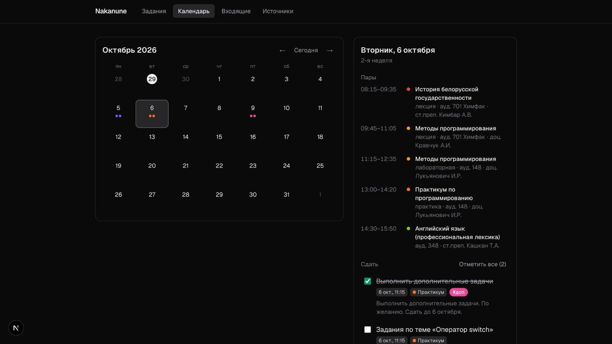
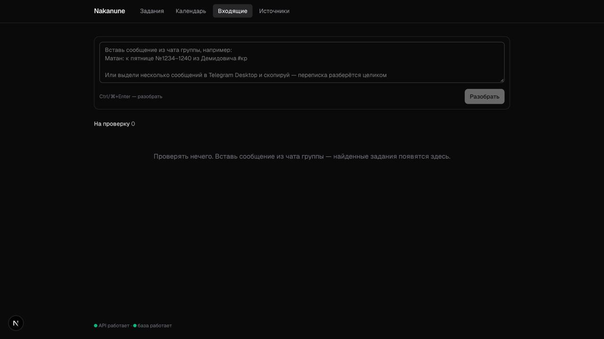

# Nakanune

Трекер заданий, который сам собирает ДЗ из учебных Telegram-групп и календаря Moodle
и показывает, что сделать к какому дню. У каждого задания — короткое ИИ-саммари: что требуется,
в каком виде сдавать, что понадобится.

> **Статус:** работают вкладки «Задания», «Календарь» и «Входящие»: задания можно вставлять
> текстом из чата — их разбирает Gemini (или эвристика без ключа). Расписание пар подтягивается
> с сайта факультета. Дальше — Moodle и Telegram как источники.







## Возможности

- **Задания** — список по срокам (просрочено / ближайшие 3 дня / неделя / позже / без срока) или
  по предметам, сводка «сегодня и на неделе», быстрое добавление с метками `#кр`, правка на месте,
  архив, фильтр по метке, предупреждения о перегруженных днях с советом «сделать накануне».
- **Календарь** — месяц с понедельника, точки несданных заданий цветом предмета; у выбранного дня
  пары по расписанию (с учётом подгруппы и недели «1н/2н») и что к нему сдать, «отметить все»;
  подписка на задания в приложении-календаре (`webcal://`) и выгрузка CSV.
- **Входящие** — вставляешь сообщение, переписку из Telegram или **фото доски**, найденные задания
  приходят на проверку: предмет, срок, саммари, полоса уверенности, исходный текст (у фото — что
  прочитал ИИ); «Принять», «Изменить», «Отклонить».
- **Приложение (PWA)** — Nakanune можно установить из браузера: Chrome — значок в адресной строке,
  iPhone — «Поделиться → На экран Домой». Иконки рисует сам Next (`app/icon.tsx`). На узком экране
  навигация сворачивается в меню-бургер.
- **Источники** — календарь Moodle (edummf.bsu.by) и чаты Telegram: задания приходят сами раз в час,
  перенесённый в Moodle срок переносится и в задании; статус и «Обновить сейчас».
- Изменения применяются сразу (оптимистично) и откатываются, если сервер ответил ошибкой.

## Стек

- **TypeScript** во всех пакетах
- **apps/web** — Next.js 16 (App Router, Turbopack), Tailwind CSS 4
- **apps/server** — Node.js 24, Express 5, запуск через tsx
- **packages/db** — PostgreSQL 17, Prisma 7 (через драйвер pg)
- **packages/shared** — zod-схемы и типы, общие для фронта и сервера
- pnpm workspaces, ESLint 9, Prettier

## Структура

```
apps/
  web/          Next.js — вкладки «Задания», «Календарь»; Zustand-стор, sonner
  server/       Express API; позже — cron, источники, ИИ
packages/
  db/           schema.prisma, миграции, сид, фабрика Prisma Client
  shared/       zod-схемы — контракт между фронтом и сервером
docker-compose.yml   Postgres для локальной разработки
```

Фронт не импортирует Prisma: он получает данные по REST, а их форму описывают схемы из
`@nakanune/shared`. Пакеты монорепо отдают TypeScript-исходники без сборки: их компилируют
Next.js (фронт) и tsx (сервер).

## Быстрый старт

Нужны Node.js 24+, pnpm 12 (`npm i -g pnpm`) и Docker.

```bash
pnpm install          # зависимости + генерация Prisma Client
cp .env.example .env  # локальные переменные окружения
pnpm db:up            # Postgres в Docker, порт 5433
pnpm db:migrate       # применить миграции
pnpm db:seed          # заполнить предметы
pnpm dev              # API на :4000 и фронт на :3000
```

На http://localhost:3000 видно, отвечают ли API и база.

## Команды

| Команда                           | Что делает                                                |
| --------------------------------- | --------------------------------------------------------- |
| `pnpm dev`                        | сервер и фронт вместе                                     |
| `pnpm dev:server`, `pnpm dev:web` | по отдельности                                            |
| `pnpm test`                       | тесты (vitest); нужен запущенный Postgres                 |
| `pnpm typecheck`                  | проверка типов во всех пакетах                            |
| `pnpm lint`                       | ESLint                                                    |
| `pnpm format`                     | Prettier                                                  |
| `pnpm build`                      | продакшен-сборка фронта                                   |
| `pnpm db:up`, `pnpm db:down`      | запустить / остановить Postgres                           |
| `pnpm db:migrate --name <имя>`    | создать и применить миграцию после правки `schema.prisma` |
| `pnpm db:generate`                | перегенерировать Prisma Client                            |
| `pnpm db:seed`                    | заполнить предметы (можно запускать повторно)             |
| `pnpm db:reset`                   | пересоздать базу: все миграции с нуля + сид               |
| `pnpm db:studio`                  | Prisma Studio — база в браузере                           |

В Prisma 7 `migrate dev` не перегенерирует клиент, поэтому после изменения схемы нужны
две команды: `pnpm db:migrate --name <имя>`, затем `pnpm db:generate`.

Тесты маршрутов работают с отдельной базой `nakanune_test` на том же Postgres: перед запуском
она создаётся и получает миграции, перед каждым тестом очищается. Рабочая база не затрагивается.

## API

| Метод и путь                   | Что делает                                                               |
| ------------------------------ | ------------------------------------------------------------------------ |
| `GET /api/health`              | жив ли сервер и есть ли связь с базой                                    |
| `GET /api/subjects`            | предметы по алфавиту                                                     |
| `POST /api/subjects`           | новый предмет; без `shortCode` код соберётся из названия («МА»)          |
| `PUT /api/subjects/:id`        | изменить предмет                                                         |
| `DELETE /api/subjects/:id`     | удалить; его задания останутся «Без предмета»                            |
| `GET /api/tasks`               | задания; фильтры `?status=&archived=&from=&to=`                          |
| `POST /api/tasks`              | одно задание или массив до 100; ответ `{ inserted, duplicates, errors }` |
| `PATCH /api/tasks`             | статус или архив сразу у нескольких заданий (одна транзакция)            |
| `PUT /api/tasks/:id`           | изменить задание                                                         |
| `DELETE /api/tasks/:id`        | удалить задание                                                          |
| `GET /api/export/calendar.ics` | календарь заданий — можно подписаться в Google Calendar                  |
| `GET /api/export/tasks.csv`    | все задания для Excel                                                    |
| `GET /api/schedule`            | недельное расписание пар; при необходимости перепроверяет сайт           |
| `POST /api/schedule/sync`      | перечитать расписание с сайта прямо сейчас (кнопка «Обновить»)           |
| `POST /api/extract`            | разобрать вставленный текст; найденное — во «Входящие»                   |
| `POST /api/extract/image`      | фото доски (тело — картинка, до 10 МБ); разбирает только ИИ              |
| `GET /api/sources`             | источники со статусом (без секретов)                                     |
| `POST /api/sources`            | добавить календарь Moodle: проверить ссылку, сохранить, синхронизировать |
| `POST /api/sources/:id/sync`   | «Обновить сейчас»                                                        |
| `POST /api/sources/sync-all`   | все источники по очереди — то же, что делает cron                        |
| `DELETE /api/sources/:id`      | удалить источник; его задания остаются                                   |
| `GET /api/telegram/status`     | подключён ли Telegram и под каким аккаунтом                              |
| `GET /api/telegram/chats`      | твои группы и каналы — выбрать, какие читать                             |

Схемы запросов и ответов — в [packages/shared/src/schemas](packages/shared/src/schemas).

## Разбор текста

Вставить можно одно сообщение или целую переписку: выдели сообщения в Telegram Desktop и скопируй —
она разделится на сообщения по заголовкам «Имя, [дата]:». Каждое сообщение сохраняется как «сырое»
(без имени автора), из них извлекаются задания, и все они попадают во «Входящие» на проверку.
Сообщение из переписки получает id — хэш времени и текста, поэтому повторная вставка той же
переписки не разбирает старые сообщения заново, но они остаются контекстом для новых.

- **Gemini** (если задан `GEMINI_API_KEY`): модели из `GEMINI_MODELS` пробуются по очереди — на
  бесплатном тарифе новые модели часто отвечают 503, тогда берётся следующая; на всю цепочку — не
  больше 45 секунд. Правила — в системной инструкции, сообщения — отдельно, JSON-данными, с прямым
  запретом выполнять команды из их текста (защита от prompt injection). Модели передаются текущая
  дата, предметы с алиасами и пары на две недели вперёд с видом (лекция/практика). Ответ — по JSON
  Schema (structured output) и проверяется той же zod-схемой
  ([packages/shared/src/schemas/extract.ts](packages/shared/src/schemas/extract.ts)).
- **Эвристика** ([packages/shared/src/nlp](packages/shared/src/nlp)) — если ключа нет или ни одна
  модель не ответила: русские даты («к пятнице», «до пт», «5.10», «на 29.09-06.10», «до 29сент»),
  предметы по алиасам в любом падеже, заголовок («ДЗ:», «Матан:») задаёт срок и предмет пунктам под
  ним, вопрос («А че по геоме») — ответам в течение часа, «дедлайн» в конце — всем заданиям сообщения;
  «читать А, сделать Б» — два задания; ссылки — в описание. Она же будет префильтром для Telegram.
- **Срок из расписания.** Домашку сдают на практике, а не на лекции (практики по математике на
  сайте записаны как «лаб.»): «к пятнице» — к началу пятничной практики по предмету, «к следующей
  паре» — к ближайшей практике. Срок не назван совсем — к следующей практике по предмету, с пометкой
  «примерно». Самостоятельные, диктанты и опросы на парах тоже сохраняются — как важные.
- **Лекции и практика — разные предметы в расписании.** У «Методов программирования» практика записана
  отдельным предметом «Практикум по программированию» (поле `Subject.practiceSubjectId`). Задания по МП,
  «проге» и «плюсам» записываются на Практикум, срок — ближайшая практика (пара МП «лаб.» или
  Практикум). Расписание при этом показывается как на сайте.

## Фото доски

Кнопка «Фото доски» во «Входящих» (на телефоне — камера или галерея). Фото уходит в Gemini с той же
системной инструкцией, что и текст, плюс поле `transcript` — текст с фото построчно; он сохраняется
как исходное сообщение, видно, что модель прочитала. Без ИИ фото не разобрать: без ключа — 503,
модели не ответили — 502 (фото можно отправить снова). Повторно то же фото не разбирается — id
сообщения = sha1 картинки.

## Расписание пар

Расписание берётся со страницы группы на [mmf.bsu.by](https://mmf.bsu.by/ru/raspisanie-zanyatij/dnevnoe-otdelenie/1-kurs/2-gruppa/).
Сама страница отвечает очень долго, и таблицы в её HTML нет, поэтому сервер берёт ту же таблицу
через REST API WordPress: ищет страницы по slug и выбирает ту, чей адрес совпал со ссылкой.

- **Когда обновляется:** раз в сутки по cron (`SCHEDULE_CRON`, по умолчанию 6:00 по Минску) и при
  открытии приложения, если с прошлой проверки прошло больше 6 часов: сохранённое расписание
  отдаётся сразу, а сайт проверяется в фоне. Плюс кнопка «Обновить».
- **Что сохраняется:** хэш таблицы. Если он не изменился, пары не переписываются. Если изменился,
  пары заменяются одной транзакцией. Ошибка сайта или пустая таблица не стирают прошлое расписание,
  а записываются в `Source.lastError`.
- **Подгруппы:** остаются только мои пары. Общая подгруппа — `defaultSubgroup` в настройках
  источника, у отдельного предмета может быть своя (`Subject.subgroup`, так у английского).
- **Недели «1н/2н»:** первая — та, в которую попадает `firstWeekDate` (1 сентября), дальше
  чередуются. Логика — в [packages/shared/src/schedule.ts](packages/shared/src/schedule.ts), её
  используют и сервер, и фронт.
- **Предметы:** строка расписания ищет предмет по названию и алиасам (так находится опечатка
  «гусударственности»), незнакомые предметы создаются автоматически.

## Календарь Moodle

Ссылка берётся в Moodle: «Календарь → Экспорт календаря → Получить URL календаря». В ней личный токен,
поэтому сервер хранит её зашифрованной (AES-256-GCM, ключ `ENCRYPTION_KEY`) и в браузер не отдаёт —
видно только адрес сайта.

- **Когда:** cron по `CRON_SCHEDULE` (по умолчанию раз в час) и кнопка «Обновить сейчас». Источники
  проверяются по очереди, ошибка одного пишется в его `lastError` и не мешает остальным.
- **Что берём:** события-сроки («срок сдачи», «закрывается»), без «открывается» и старше недели.
  Срок — из события, точный; предмет — по названию курса (`CATEGORIES`). Предмет нашёлся — задание
  сразу в «Задания», нет — во «Входящие» на проверку.
- **Изменения:** событие = сырое сообщение с `externalId` = UID. Перенесли срок в Moodle — задание
  переносится (если ещё не выполнено); название не трогаем — его могли поправить руками.

## Telegram

Клиент — [teleproto](https://github.com/sanyok12345/teleproto) (MIT): поддерживаемый форк GramJS,
на который ссылается сам архивный репозиторий GramJS. Это userbot: читает группы, в которых ты уже
состоишь, ничего не пишет и не отмечает прочитанным.

1. `api_id` и `api_hash` — на [my.telegram.org](https://my.telegram.org/apps) → в `.env` как
   `TG_API_ID`, `TG_API_HASH`.
2. Вход из терминала: `pnpm tg:login` (номер → код → пароль 2FA). Выход: `pnpm tg:logout`.
3. «Источники» → «Выбрать чаты» → «Добавить».

- **Сессия** — полный доступ к аккаунту. Она хранится не в `.env`, а в базе (`Credential`),
  зашифрованной ключом `ENCRYPTION_KEY`: чтобы ей воспользоваться, нужны и база, и ключ. На экран
  не выводится, в браузер не отдаётся.
- **Синхронизация:** раз в час (`CRON_SCHEDULE`) сообщения новее курсора (`Source.lastCursor` — id
  последнего прочитанного); при добавлении — последняя неделя. FloodWait до 30 с клиент пережидает
  сам, длинный — ошибка в статусе источника, попытка через час.
- **Префильтр** (раздел 11.1 ТЗ): в ИИ идут только сообщения с признаком задания (глагол, маркер,
  пункт списка) и до пяти сообщений за час перед каждым — там бывает вопрос «что по геоме?». Одна
  болтовня — Gemini не вызывается. Пачки до 30 сообщений, имён авторов нет.
- **Статус:** уверенность ≥ 75 и точный срок — сразу в «Задания», иначе во «Входящие».

## Переменные окружения

- `.env` в корне — сервер и Prisma. Шаблон с пояснениями: [.env.example](.env.example).
- `apps/web/.env.local` — фронт, необязательно. Шаблон: [apps/web/.env.example](apps/web/.env.example).

Сервер проверяет переменные zod-схемой при старте ([apps/server/src/env.ts](apps/server/src/env.ts))
и с неверным конфигом сразу завершается.

## План

- [x] Этап 0 — каркас: монорепо, Postgres + Prisma, Express, Next.js, линтеры
- [x] Этап 1 — API предметов и заданий, экспорт `.ics` и CSV, тесты
- [x] Расписание пар с сайта ММФ — синхронизация раз в сутки и при открытии приложения
- [x] Этап 2 — фронт: «Задания» и «Календарь»
- [x] Этап 3 — ручное добавление + ИИ, вкладка «Входящие»
- [x] Этап 4 — Moodle + cron, вкладка «Источники»
- [x] Этап 5 — Telegram: вход из терминала, выбор чатов, префильтр, пачки в ИИ
- [x] Этап 6 — фото доски, подписка на `.ics`, PWA, свёрнутые длинные описания
